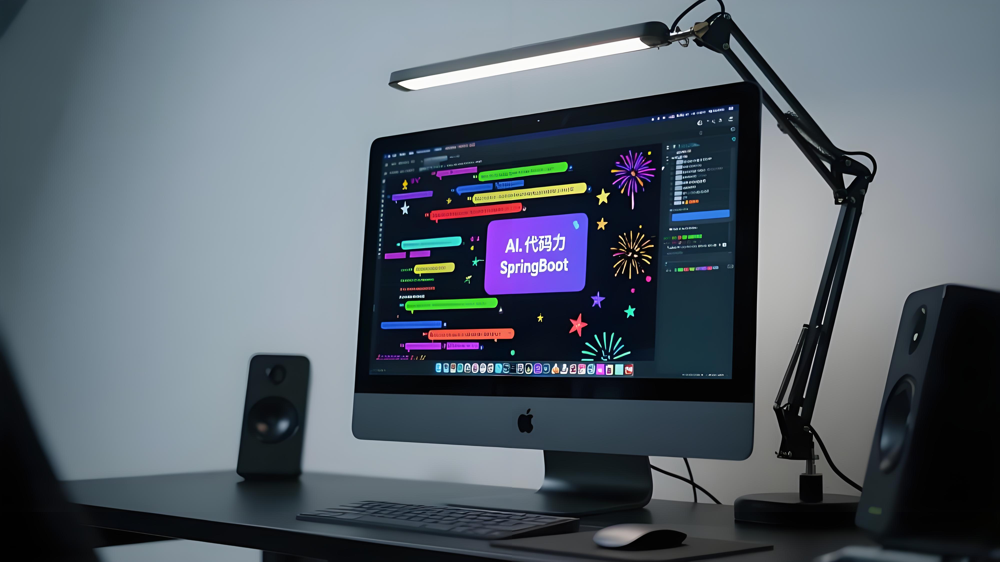

# SpringBoot实时弹幕系统 | 高性能实时互动解决方案  

基于SpringBoot的轻量级实时弹幕系统实现，支持高并发消息推送、历史弹幕时间轴关联、内容安全过滤等核心功能，适用于直播平台、在线教育、互动视频等场景。  

## 🚀 核心功能  
- **实时弹幕推送**：通过WebSocket+STOMP协议实现低延迟（<300ms）消息广播，支持万人级并发  
- **时间轴关联**：弹幕与视频时间点绑定，历史弹幕随播放进度自动重现  
- **内容安全过滤**：内置敏感词过滤机制，支持动态词库扩展  
- **多端兼容**：前端支持PC/移动端浏览器，兼容不支持WebSocket的旧版浏览器（通过SockJS降级）  
- **数据持久化**：集成MyBatis-Plus实现弹幕存储，支持H2/MySQL等多种数据库  
- **可视化管理**：提供H2数据库控制台（开发环境），方便调试与数据查看  

## 🛠 快速开始  

### 环境要求  
| 工具/框架       | 版本要求          | 说明                  |  
|-----------------|-------------------|-----------------------|  
| JDK             | 17+               | 推荐OpenJDK 17        |  
| Maven           | 3.8+              | 依赖管理              |  
| 浏览器          | Chrome 80+/Edge 90+ | 推荐现代浏览器体验最佳 |  

### 步骤1：克隆项目  git clone https://github.com/aiseall/damuku.git
cd danmaku

### 步骤2：构建与运行  
#### 方式1：直接运行（开发环境）  
在IDE（如IntelliJ IDEA）中打开项目，找到`DanmakuApplication.java`主类，直接运行`main`方法启动服务。  

#### 方式2：Maven打包运行（生产环境）  # 构建可执行JAR包
mvn clean package

# 启动服务（默认端口8080）
java -jar target/danmaku-system-1.0.0.jar

### 步骤3：访问测试  
1. 打开浏览器访问前端页面：`http://localhost:8080/index.html`  
2. 在输入框输入弹幕内容，选择颜色后点击“发送”，实时弹幕会从右向左滚动显示  
3. 查看H2数据库控制台（开发环境）：`http://localhost:8080/h2-console`（JDBC URL: `jdbc:h2:mem:danmaku_db`，用户名`sa`，密码空）  

## 📁 项目结构  danmaku-system/
├── src/
│   ├── main/
│   │   ├── java/com/example/danmaku/
│   │   │   ├── config/         # WebSocket等核心配置
│   │   │   ├── controller/     # 接口与消息控制器
│   │   │   ├── model/          # 弹幕实体类
│   │   │   ├── service/        # 核心业务逻辑
│   │   │   └── DanmakuApplication.java  # 启动类
│   │   └── resources/
│   │       ├── application.properties  # 应用配置
│   │       ├── schema.sql              # 数据库初始化脚本
│   │       └── static/                 # 前端页面与JS
│   └── test/                          # 测试用例（待扩展）
├── pom.xml                            # Maven依赖配置
└── README.md                          # 项目文档

## 🛠️ 技术栈  
| 分类         | 技术/工具                | 说明                          |  
|--------------|--------------------------|-------------------------------|  
| 后端框架     | SpringBoot 3.2.0         | 快速构建Web服务               |  
| 实时通信     | WebSocket + STOMP        | 全双工通信协议                |  
| 持久层       | MyBatis-Plus 3.5.5       | ORM框架，简化数据库操作       |  
| 数据库       | H2（开发）/MySQL（生产） | 内存数据库（开发）或关系型数据库|  
| 前端交互     | SockJS + Stomp.js        | WebSocket兼容性增强库         |  
| 工具库       | Lombok                   | 简化Java实体类代码            |  

## 🤝 贡献指南  
欢迎参与项目贡献！以下是贡献流程：  

1. **提交Issue**：发现Bug或建议新功能时，先在[Issue列表](https://github.com/aiseall/damuku/issues)中创建问题描述  
2. **Fork仓库**：通过GitHub的Fork按钮复制项目到个人仓库  
3. **创建分支**：基于`main`分支创建特性分支（如`feature/add-rate-limit`）  
4. **提交代码**：完成开发后提交Pull Request，描述修改内容  
5. **代码审查**：维护者会在24小时内反馈审查意见，通过后合并到主分支  

## 📜 许可证  
本项目采用[MIT许可证](https://opensource.org/licenses/MIT)，允许自由使用、修改和分发，但需保留原作者信息。  

## ✨ 联系我们  
- 邮箱：xiaomu@ai4se.cn
- 问题反馈：[GitHub Issues](https://github.com/aiseall/damuku/issues)  

如果项目对你有帮助，欢迎Star ⭐ 支持！  
    